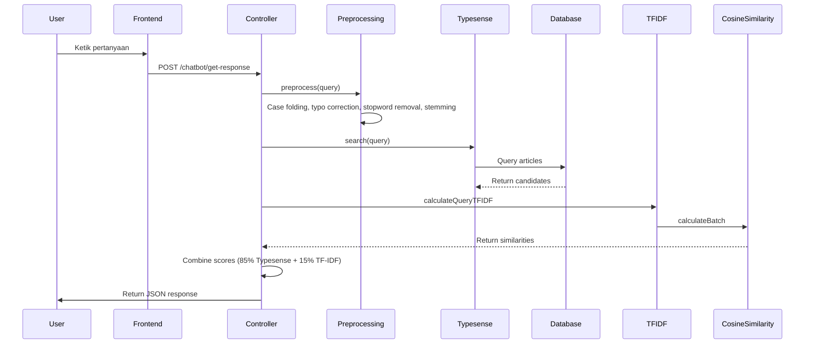

# ANALISIS SISTEM HELPDESKTA - DOKUMENTASI LENGKAP SKRIPSI

**Tanggal Analisis:** 5 Juni 2026  
**Versi Sistem:** Laravel 10.x  
**Tujuan:** Persiapan Bimbingan dan Sidang Skripsi

---

## 1. GAMBARAN SISTEM

### 1.1 Nama dan Tujuan
**Nama:** HelpDeskTA - Sistem Helpdesk dengan Chatbot TF-IDF  
**Tujuan:** Menyediakan sistem helpdesk terintegrasi dengan chatbot pencarian artikel otomatis dan manajemen tiket support

### 1.2 Permasalahan
- Staff support terbatas dan tidak bisa 24/7
- Pencarian artikel manual sulit
- Manajemen tiket manual
- Tracking tiket sulit
- Duplikasi pertanyaan

### 1.3 Aktor
- **Guest:** Pengunjung tanpa login
- **Staff:** Staff support
- **Admin:** Administrator sistem

### 1.4 Fitur Utama
**Guest:** Pencarian artikel, chatbot TF-IDF, pembuatan tiket dengan OTP, tracking tiket, feedback artikel  
**Staff:** Dashboard tiket, manajemen tiket (accept/progress/complete), CRUD artikel, real-time chat  
**Admin:** Dashboard statistik, manajemen user/staff, approval artikel, toggle live service

### 1.5 Teknologi
**Backend:** Laravel 10.x, MySQL/MariaDB, Typesense, Redis  
**Frontend:** Blade, TailwindCSS, Alpine.js, Axios, Laravel Echo + Pusher  
**Libraries:** Laravel Scout, Sanctum, Reverb

---

## 2. STRUKTUR FILE PENTING

### 2.1 Controllers
| File | Fungsi |
|------|--------|
| ChatbotController.php | Main chatbot endpoint, TF-IDF retrieval, ticket creation |
| ArticleController.php | CRUD artikel (staff & public), feedback |
| TicketController.php | Guest ticket creation, OTP verification, tracking |
| Staff/TicketController.php | Ticket management (accept, progress, complete) |
| Admin/DashboardController.php | Admin dashboard, statistics |
| Admin/CategoryController.php | CRUD kategori, assign staff |
| Admin/UserController.php | CRUD user (staff) |
| Admin/ArticleController.php | Approval artikel |

### 2.2 Models
| File | Fungsi |
|------|--------|
| Article.php | Model artikel dengan relasi category, staff, feedback |
| Ticket.php | Model tiket dengan relasi category, staff, messages |
| User.php | Model user dengan role (admin/staff) |
| Category.php | Model kategori untuk artikel dan tiket |
| Message.php | Model pesan chat tiket |
| StaffProfile.php | Profil staff dengan category assignment, is_busy flag |
| TicketLog.php | Log audit perubahan tiket |
| ArticleKeywordIndex.php | Index TF-IDF untuk artikel |
| ArticleFeedback.php | Feedback artikel (helpful/not helpful) |
| TicketOtp.php | OTP verification untuk ticket creation |

### 2.3 Services (Chatbot)
| File | Fungsi |
|------|--------|
| PreprocessingService.php | Text preprocessing (case folding, typo correction, stopword removal, stemming) |
| TfidfService.php | TF-IDF calculation dengan low-priority term reduction |
| CosineSimilarityService.php | Cosine similarity calculation |
| ChatbotRetrievalService.php | Main retrieval (Typesense 85% + TF-IDF 15%) |
| AdvancedRetrievalService.php | Advanced retrieval dengan multi-intent, diversification |
| DomainDetectionService.php | Deteksi domain query |
| TypesenseService.php | Typesense search engine integration |

### 2.4 Routes
**Web:** `/`, `/dashboard`, `/admin/*`, `/staff/*`, `/help`, `/articles`, `/chatbot/*`, `/tickets/*`  
**API:** `/api/messages`, `/api/tickets/{id}/messages`, `/api/tickets/{id}/status`

### 2.5 Migrations
- users, categories, articles, article_feedback, staff_profiles, tickets, messages, ticket_logs, notifications, chatbot, article_keyword_index, ticket_otps, settings

---

## 3. ANALISIS DATABASE

### 3.1 Tabel Utama
| Tabel | PK | FK | Deskripsi |
|-------|----|----|----------|
| users | ulid | - | User authentication, role (admin/staff) |
| categories | ulid | - | Kategori untuk artikel dan tiket |
| articles | ulid | category_id, staff_id | Artikel knowledge base |
| tickets | ulid | category_id, user_id, staff_id | Tiket support |
| messages | ulid | ticket_id, sender_id | Pesan chat tiket |
| staff_profiles | ulid | user_id, category_id | Profil staff dengan is_busy |
| ticket_logs | ulid | ticket_id | Log audit tiket |
| article_keyword_index | ulid | article_id | Index TF-IDF |

### 3.2 Relasi
```
users (1) ── (N) articles
users (1) ── (N) staff_profiles
users (1) ── (N) tickets

categories (1) ── (N) articles
categories (1) ── (N) staff_profiles
categories (1) ── (N) tickets

tickets (1) ── (N) messages
tickets (1) ── (N) ticket_logs
```

---

## 4. ANALISIS CHATBOT (FOKUS)

### 4.1 Pipeline
```
User Input → Preprocessing → Typesense (85%) → TF-IDF (15%) → Cosine Similarity → Score Combination → Top 5 Results
```

### 4.2 Preprocessing (PreprocessingService.php)
**Steps:**
1. Case folding (lowercase)
2. Typo correction (dictionary + repeated char normalization)
3. Cleaning (hapus karakter spesial)
4. Tokenization (pisahkan kata)
5. Stopword removal (150+ stopwords Bahasa Indonesia)
6. Stemming (Bahasa Indonesia, kecuali protected technical tokens)
7. Filter short tokens (< 2 chars)

**Protected Tokens:** ransomware, malware, virus, dll (TIDAK di-stem)

### 4.3 TF-IDF (TfidfService.php)
**Formula:**
```
TF = count(term) / total_terms
IDF = log(1 + total_docs / (1 + docs_with_term)) + 1
TF-IDF = TF × IDF
```

**Low-Priority Terms:** cara, mengatasi, solusi, dll (weight 0.1)

### 4.4 Cosine Similarity (CosineSimilarityService.php)
**Formula:**
```
similarity(A, B) = (A · B) / (||A|| × ||B||)
```

### 4.5 Retrieval (ChatbotRetrievalService.php)
**Configuration:**
- Typesense weight: 85% (primary)
- TF-IDF weight: 15% (secondary)
- Similarity threshold: 0.05
- Title match boost: 0.5
- Exact match boost: 0.3

---

## 5. ALUR SISTEM

### 5.1 Guest Flow
**Buka Website:** `/` → redirect based on auth  
**Lihat Artikel:** `/articles` → `/articles/{slug}` → include chatbot widget  
**Chatbot:** Ketik query → POST `/chatbot/get-response` → TF-IDF retrieval → return articles  
**Buat Tiket:** `/help` → request OTP → verify OTP → create ticket → auto-assign staff

### 5.2 Admin Flow
**Login:** `/login` → `/admin/dashboard`  
**Dashboard:** Query statistik (staff count, article count, ticket stats, staff performance)  
**Approval Artikel:** `/admin/articles` → approve/reject → update publish_status  
**Kelola User:** `/admin/users` → CRUD staff dengan category assignment

### 5.3 Staff Flow
**Login:** `/login` → `/staff/dashboard`  
**Kelola Tiket:** `/staff/tickets` → view active ticket → start progress → complete → auto-assign next  
**Kelola Artikel:** `/staff/articles` → create (pending) → admin approve → published

---

## 6. SEQUENCE DIAGRAM CHATBOT



---

## 7. DOMAIN MODEL

**Entities:** User, Article, Category, Ticket, Message, StaffProfile, TicketLog, ArticleFeedback

**Relasi Utama:**
- User (1) ── (N) Article
- User (1) ── (N) Ticket
- Category (1) ── (N) Article
- Category (1) ── (N) Ticket
- Ticket (1) ── (N) Message

---

## 8. USE CASE

**Guest:** Melihat artikel, chatbot TF-IDF, buat tiket, tracking tiket, feedback artikel  
**Admin:** Login, dashboard, kelola user, kelola kategori, approval artikel, toggle live service  
**Staff:** Login, dashboard, kelola tiket (accept/progress/complete), CRUD artikel, chat dengan guest

---

## 9. ARSITEKTUR CHATBOT

```
Frontend → Controller → AdvancedRetrievalService → ChatbotRetrievalService → PreprocessingService → Typesense (85%) + TF-IDF (15%) → CosineSimilarity → Database → Response
```

**Layers:**
- Frontend: Chatbot widget dengan JavaScript
- Controller: Input validation, service delegation
- Service: Retrieval logic, preprocessing, similarity calculation
- Database: Articles, TF-IDF index, Typesense

---

## 10. PERTANYAAN BIMBINGAN (20)

1. **Q:** Kenapa TF-IDF? **A:** Explainable, tidak perlu training data, cocok untuk domain-specific, biaya rendah
2. **Q:** Kenapa hybrid Typesense+TF-IDF? **A:** Typesense cepat (85%), TF-IDF akurat (15%), balance optimal
3. **Q:** Bagaimana typo handling? **A:** Repeated char normalization + dictionary lookup (200+ entries)
4. **Q:** Fungsi stopword removal? **A:** Hapus kata umum (150+ stopwords), reduce noise
5. **Q:** Kenapa tidak semua kata di-stem? **A:** Protected technical tokens (ransomware, malware) TIDAK di-stem
6. **Q:** Bagaimana jika tidak ada hasil? **A:** Confidence low → suggest ticket creation
7. **Q:** Perbedaan status tiket? **A:** open→assigned→progress→waiting→closed
8. **Q:** Auto-assignment bekerja? **A:** Load balancing, staff dengan load paling sedikit, is_busy flag
9. **Q:** Kenapa ULID? **A:** Sortable by time, URL-friendly, collision-resistant
10. **Q:** Anti-spam? **A:** Rate limiting, CAPTCHA, OTP verification
11. **Q:** article_keyword_index? **A:** Precomputed TF-IDF vectors untuk fast retrieval
12. **Q:** Confidence level? **A:** high (≥0.15), medium (≥0.05), low (<0.05)
13. **Q:** Kenapa 85/15 weight? **A:** Typesense lebih cepat, TF-IDF untuk reranking halus
14. **Q:** WebSocket? **A:** Real-time chat antara guest dan staff
15. **Q:** Approval workflow? **A:** Staff create (pending) → admin approve/reject
16. **Q:** livechat vs report? **A:** livechat untuk real-time, report untuk follow-up
17. **Q:** Caching? **A:** Redis untuk IDF (24 jam), vectors (24 jam), topics (1 jam)
18. **Q:** Domain detection? **A:** Deteksi domain (networking/hardware/software) untuk filtering
19. **Q:** Multi-intent? **A:** Split query dengan "dan/atau", combine dan diversifikasi
20. **Q:** Kelemahan? **A:** Tidak semantic understanding, tidak learning, single language

---

## 11. PERTANYAAN SIDANG (20)

1. **Q:** Jelaskan TF-IDF detail. **A:** TF = count/total, IDF = log(docs/term_docs), TF-IDF = TF×IDF
2. **Q:** Kenapa Cosine Similarity? **A:** Tidak terpengaruh panjang vektor, range 0-1, standar industri
3. **Q:** Beda dengan LLM? **A:** Sistem: deterministic, explainable, ringan. LLM: black box, berat, mahal
4. **Q:** Inovasi? **A:** Hybrid retrieval, protected tokens, low-priority reduction, auto-assignment
5. **Q:** Evaluasi performa? **A:** Confidence level, similarity score, feedback, response time
6. **Q:** Dampak low-priority reduction? **A:** Generic terms tidak dominasi, domain terms lebih penting
7. **Q:** Out-of-domain? **A:** Domain detection, low confidence, suggest ticket
8. **Q:** Auto-assignment detail? **A:** Load balancing, is_busy flag, category-based
9. **Q:** ArticleObserver? **A:** Listen model events, auto-invalidate cache, reindex
10. **Q:** Keamanan? **A:** Rate limiting, CAPTCHA, OTP, CSRF, input validation
11. **Q:** Kenapa Laravel? **A:** Eloquent ORM, auth, events, queue, rich ecosystem
12. **Q:** Concurrent assignment? **A:** Database transactions, lockForUpdate, race prevention
13. **Q:** Caching strategy? **A:** Redis, 24 jam IDF/vectors, 1 jam topics, observer invalidation
14. **Q:** Multi-intent splitting? **A:** Detect separators, split, retrieve, combine, diversify
15. **Q:** Rule-based vs TF-IDF? **A:** Rule: keywords hardcoded. TF-IDF: statistical, semantic
16. **Q:** Artikel belum approve? **A:** is_published=false, publish_status=pending, filter di query
17. **Q:** field_boosts? **A:** JSON field, title weight 3x, content weight 1x
18. **Q:** Keberhasilan chatbot? **A:** Confidence distribution, feedback ratio, escalation rate
19. **Q:** Future improvements? **A:** Sentiment analysis, ML matching, multi-language, analytics
20. **Q:** Tetap TF-IDF? **A:** Ya, explainable, no training data, low cost, domain-specific

---

## 12. PRESENTASI 5 MENIT

**Slide 1:** Judul, permasalahan, solusi  
**Slide 2:** Gambaran sistem, fitur utama, teknologi  
**Slide 3:** Arsitektur chatbot (pipeline TF-IDF)  
**Slide 4:** Sistem ticketing (auto-assignment, status flow)  
**Slide 5:** Hasil, kesimpulan, terima kasih

---

## 13. TITIK PENTING SKRIPSI

### Inovasi
- Hybrid Typesense (85%) + TF-IDF (15%)
- Protected technical tokens (tidak di-stem)
- Low-priority term weight reduction
- Auto-assignment dengan load balancing
- Multi-intent query handling

### Algoritma Utama
- TF-IDF: `TF × IDF` untuk relevance
- Cosine Similarity: `(A·B)/(||A||×||B||)` untuk similarity
- Load Balancing: Sort by (active_tickets ASC, waiting_tickets ASC)

### Kekurangan
- Tidak semantic understanding
- Tidak learning dari feedback
- Rule-based terbatas
- Single language (Bahasa Indonesia)
- Tidak sentiment analysis

### Kelebihan
- Explainable dan deterministic
- Ringan dan efisien
- Domain-specific optimization
- Hybrid approach optimal
- Auto-assignment cerdas

### Kenapa TF-IDF
- Explainable untuk skripsi
- Tidak perlu training data
- Cocok domain-specific
- Biaya rendah
- Standar industri

### Kenapa Cosine Similarity
- Tidak terpengaruh panjang dokumen
- Range 0-1 intuitif
- Standar industri
- Efisien komputasi
- Mudah diimplementasikan

### Kenapa Tidak LLM
- Biaya tinggi
- Black box
- Tidak deterministic
- Overkill untuk use case
- Privacy concerns

---

## 14. SYSTEM MAP

**Entry Points:** `/`, `/login`, `/dashboard`, `/help`, `/articles`, `/chatbot/*`, `/tickets/*`

**Guest Flow:** `/help` → TicketController → OTP → Create Ticket → Auto-assign  
**Chatbot Flow:** `/chatbot/get-response` → ChatbotController → Preprocessing → Typesense + TF-IDF → Response  
**Admin Flow:** `/admin/dashboard` → Statistics → `/admin/articles` → Approval  
**Staff Flow:** `/staff/tickets` → Manage Tickets → Auto-assign Next

**Models:** User, Article, Category, Ticket, Message, StaffProfile, TicketLog, ArticleFeedback, ArticleKeywordIndex

**Services:** PreprocessingService, TfidfService, CosineSimilarityService, ChatbotRetrievalService, TypesenseService

**Database:** MySQL (users, articles, tickets, messages), Typesense (search index), Redis (cache)

---

**Dokumentasi ini dibuat untuk persiapan bimbingan dan sidang skripsi.**
