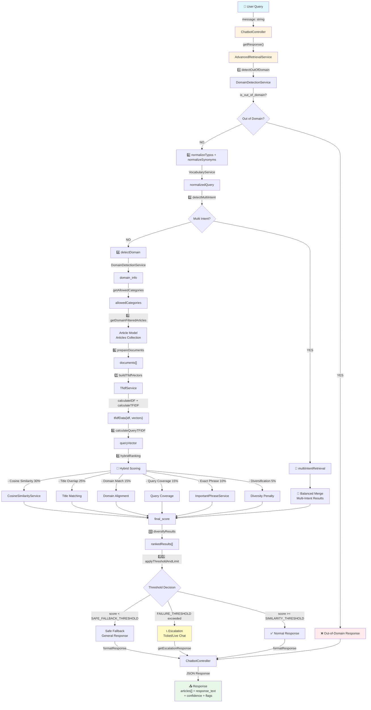
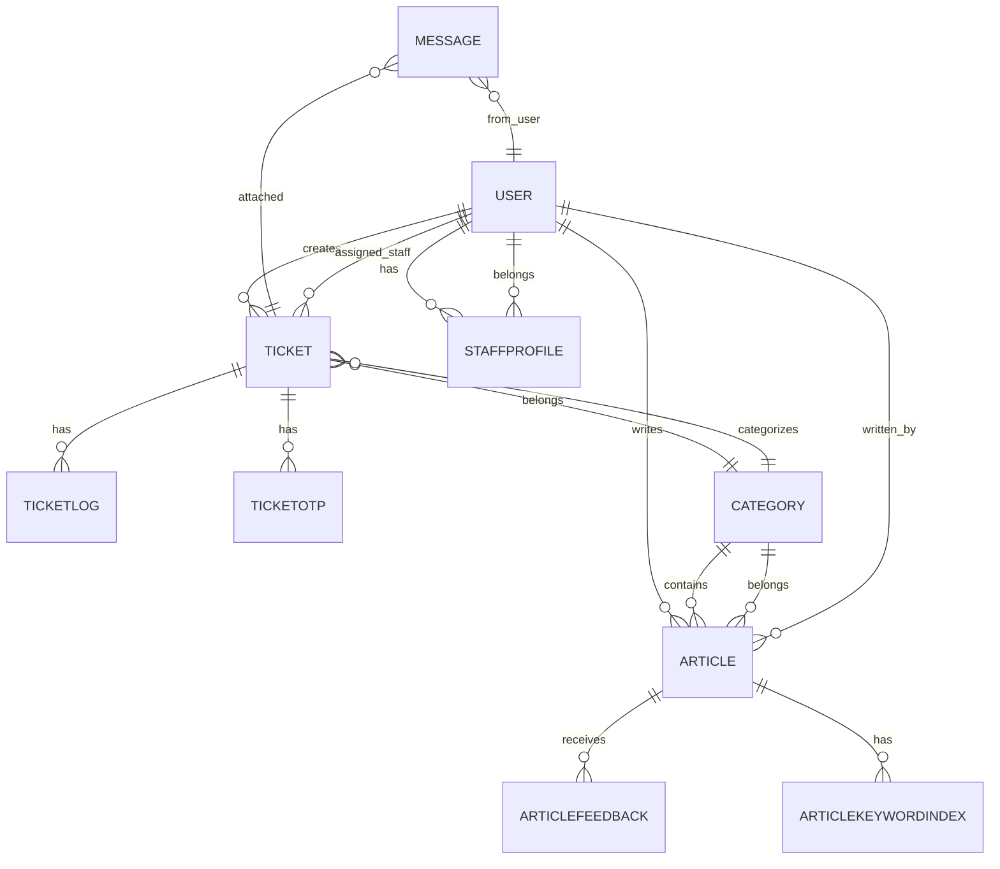

# Diagram Alur Sistem Helpdesk TA

Dokumentasi ini berisi diagram Mermaid yang akurat berdasarkan implementasi source code. Setiap diagram menunjukkan alur lengkap dengan input, controller, service, model, dan output.

---

## 1. Diagram Alur Chatbot (Advanced Retrieval)

### Penjelasan Alur Chatbot

| Tahap | Deskripsi |
|-------|-----------|
| **Input** | Query user (string), max 1000 karakter |
| **1️⃣ Out-of-Domain Detection** | `DomainDetectionService::detectOutOfDomain()` menolak query yang tidak relevan dengan IT/support |
| **2️⃣ Normalisasi** | `VocabularyService` melakukan koreksi typo dan sinonim |
| **3️⃣ Multi-Intent Detection** | `detectMultiIntent()` memisahkan query dengan konjungsi (dan, atau, dengan, serta) |
| **4️⃣ Domain Detection** | Menentukan domain (wifi, printer, email, dll) untuk filtering kategori |
| **5️⃣ Candidate Selection** | Query model `Article` dengan kategori yang diizinkan |
| **6️⃣-7️⃣ TF-IDF Vectors** | `TfidfService` membangun vektor TF-IDF untuk dokumen |
| **8️⃣-9️⃣ Hybrid Ranking** | `hybridRanking()` menggabungkan 6 sinyal dengan bobot tertentu: |
|  | • **Cosine Similarity** (30%) — kesamaan term-document |
|  | • **Title Overlap** (25%) — keyword match di title |
|  | • **Domain Match** (15%) — alignment kategori dokumen |
|  | • **Query Coverage** (15%) — persentase term query di dokumen |
|  | • **Exact Phrase** (10%) — bonus untuk phrase penting |
|  | • **Diversification** (5%) — penalti untuk mengurangi duplikasi |
| **1️⃣0️⃣ Diversification** | `diversifyResults()` mengurangi dominasi satu kategori |
| **1️⃣1️⃣ Threshold Decision** | `applyThresholdAndLimit()` memilih aksi: |
|  | • **score ≥ SIMILARITY_THRESHOLD (0.12)** → tampilkan artikel |
|  | • **score < SAFE_FALLBACK_THRESHOLD (0.18)** → safe fallback |
|  | • **failure count ≥ FAILURE_THRESHOLD (3)** → eskalasi tiket/live chat |
| **Output** | JSON: `{success, response, articles[], confidence, flags}` |
| **Model** | `Article`, `Category` |

---

## 2. Diagram Alur Ticketing

```mermaid
flowchart TD
    A["👤 User/Guest"] -->|"Form / API Request"| B["TicketController"]
    B -->|"create()"| C["📋 Show Ticket Form<br/>with Categories"]
    
    C -->|"user inputs"| D["store()"]
    D -->|"Validate"| E["✅ Validation Rules"]
    E -->|"name, email, subject,<br/>message, category_id,<br/>captcha"| F{"Valid?"}
    
    F -->|"NO"| G["❌ Validation Error<br/>Redirect with errors"]
    F -->|"YES"| H["🔍 Rate Limit Check<br/>IP + Email"]
    
    H -->|"Within limit?"| I{"Allowed?"}
    I -->|"NO"| J["❌ Too Many Requests<br/>Try again later"]
    I -->|"YES"| K["💾 DB Transaction Start"]
    
    K -->|"create()"| L["Ticket Model<br/>Save: name, email, subject,<br/>message, category_id,<br/>user_id, staff_id,<br/>status, priority"]
    
    L -->|"1️⃣ Track token generation"| M["tracking_token"]
    M -->|"2️⃣ Create TicketLog"| N["TicketLog Model<br/>action: 'created'"]
    
    N -->|"3️⃣ Auto-assign staff"| O["🔄 StaffProfile Query<br/>Least busy staff<br/>in category"]
    
    O -->|"Update staff_id"| P["Ticket.staff_id"]
    P -->|"4️⃣ Create OTP (optional)"| Q["TicketOtp Model"]
    
    Q -->|"5️⃣ Generate OTP"| R["6-digit code"]
    R -->|"6️⃣ Send Email"| S["Mail::send"]
    
    S -->|"TicketOtpMail"| T["📧 Kirim OTP ke Email User"]
    S -->|"TicketTrackingMail"| U["📧 Kirim Tracking Token"]
    
    T --> V["💾 DB Transaction Commit"]
    U --> V
    
    V -->|"Response"| W["✅ Success Response<br/>ticket_id, tracking_token<br/>message"]
    
    W -->|"🔗 Eskalasi dari Chatbot"| X["ChatbotController<br/>escalate() action"]
    
    G --> W
    J --> W
    
    X -->|"Create tiket via API<br/>dengan category dari domain"| Y["Ticket Created"]
    
    Y -->|"Staff view"| Z["Staff/TicketController"]
    Z -->|"index()"| AA["📋 List Assigned Tickets<br/>Filtered by status"]
    
    AA -->|"show()"| AB["👁️ View Ticket Detail<br/>with messages & logs"]
    AB -->|"assignTicket / updatePriority"| AC["🎯 Update Priority"]
    
    AC -->|"update()"| AD["Ticket.priority"]
    AD -->|"Create TicketLog"| AE["TicketLog Model"]
    
    AE -->|"Send Notification"| AF["Mail::send<br/>Notify user & staff"]
    AF -->|"Update status"| AG["✅ Ticket.status<br/>assigned → progress<br/>→ waiting → closed"]
    
    style A fill:#e1f5ff
    style B fill:#fff3e0
    style W fill:#e8f5e9
    style G fill:#ffebee
    style J fill:#ffebee
    style AA fill:#fff3e0
    style AB fill:#fff3e0
```

### Penjelasan Alur Ticketing

| Tahap | Deskripsi |
|-------|-----------|
| **Input** | Form data: name, email, subject, message, category_id, captcha |
| **Validation** | Memastikan email valid, subject & message tidak kosong, category exists |
| **Rate Limit** | Cek IP & email untuk mencegah spam (max requests per interval) |
| **Save Ticket** | Create Ticket model dengan status awal 'new' |
| **1️⃣-2️⃣ Tracking** | Generate tracking token, create TicketLog untuk audit trail |
| **3️⃣ Auto-assign** | Query StaffProfile untuk staff paling sedikit tugas di kategori tsb |
| **4️⃣-5️⃣ OTP** | Generate 6-digit OTP untuk verifikasi email (opsional) |
| **6️⃣ Notify** | Kirim 2 email: OTP + tracking token |
| **Output (Guest)** | JSON/Redirect: `{success, ticket_id, tracking_token}` |
| **Escalation** | Chatbot dapat memicu pembuatan tiket via endpoint eskalasi |
| **Staff View** | Staff login → lihat tiket assigned → update priority/status → notify |
| **Model** | `Ticket`, `TicketLog`, `TicketOtp`, `StaffProfile`, `Category` |

---

## 3. Diagram Alur Knowledge Base (Article Management)

```mermaid
flowchart TD
    A["👨‍💼 Staff"] -->|"authenticated"| B["ArticleController"]
    
    B -->|"index()"| C["📋 List Articles<br/>with feedback count"]
    C -->|"Showing: owned articles first,<br/>other articles below"| D["Article.with('category')<br/>+ feedback counts"]
    
    D -->|"create()"| E["📝 Show Article Form"]
    E -->|"Form inputs"| F["store()"]
    
    F -->|"validate()"| G["✅ Validation<br/>category_id, title, content,<br/>excerpt, keywords"]
    G -->|"Generate slug"| H["Str::slug(title)"]
    
    H -->|"save()"| I["Article Model<br/>Create: title, content,<br/>excerpt, keywords,<br/>category_id, staff_id,<br/>slug, is_published,<br/>publish_status"]
    
    I -->|"(Optional)"| J["TypesenseService<br/>Index article"]
    J -->|"Add to search index"| K["🔍 Typesense Index"]
    
    K -->|"Response"| L["✅ Article Created<br/>Redirect to article page"]
    
    L -->|"edit()"| M["📝 Edit Article Form<br/>Pre-filled data"]
    M -->|"update()"| N["Article.update()"]
    
    N -->|"Modify fields"| O["Article Model<br/>Update content & metadata"]
    O -->|"Optional"| P["TypesenseService<br/>Re-index"]
    P -->|"Update in index"| K
    
    O -->|"Response"| Q["✅ Article Updated"]
    
    Q -->|"publish_status: 'pending' → 'approved'"| R["🔄 Admin/Moderator<br/>Review & Publish"]
    R -->|"is_published: true"| S["📰 Article Published"]
    
    S -->|"Used by Chatbot"| T["AdvancedRetrievalService"]
    T -->|"getDomainFilteredArticles"| U["Article.where()<br/>with('category')"]
    
    U -->|"prepareDocuments"| V["Document Pool<br/>for TF-IDF"]
    V -->|"Ranking & Retrieval"| W["articles[] returned<br/>to user"]
    
    B -->|"destroy()"| X["🗑️ Soft Delete / Archive"]
    X -->|"Update is_hidden"| Y["Article.is_hidden = true"]
    Y -->|"Optional"| Z["TypesenseService<br/>Remove from index"]
    
    style A fill:#e1f5ff
    style B fill:#fff3e0
    style I fill:#fff3e0
    style K fill:#fce4ec
    style S fill:#e8f5e9
    style T fill:#fff3e0
    style W fill:#e8f5e9
```

### Penjelasan Alur Knowledge Base

| Tahap | Deskripsi |
|-------|-----------|
| **Input** | Staff: title, content, excerpt, keywords, category_id |
| **CRUD Operations** | ArticleController menyediakan index, create, store, edit, update, destroy |
| **Validation** | Pastikan kategori valid, title & content tidak kosong, keywords format benar |
| **Save Article** | Buat Article model dengan staff_id sebagai creator |
| **Slug Generation** | `Str::slug()` membuat URL-friendly slug dari title |
| **Indexing** | (Opsional) TypesenseService mengindex artikel untuk search |
| **Publishing** | Admin review → approve → is_published = true |
| **Retrieval** | AdvancedRetrievalService query artikel published untuk kandidat retrieval |
| **Document Pool** | PreprocessingService + TfidfService menggunakan artikel sebagai dokumen |
| **Feedback** | ArticleFeedback model menyimpan helpful/not helpful votes |
| **Archive** | Soft delete via is_hidden flag, tetap di DB untuk history |
| **Model** | `Article`, `Category`, `ArticleFeedback`, `ArticleKeywordIndex` (optional) |

---

## 4. Diagram Login dan Otorisasi

```mermaid
flowchart TD
    A["👤 User / Staff / Admin"] -->|"Visit /login"| B["Auth/AuthenticatedSessionController"]
    B -->|"create()"| C["📝 Show Login Form"]
    
    C -->|"Email + Password"| D["store()"]
    D -->|"Validate"| E["LoginRequest<br/>auth.failed"]
    
    E -->|"✅ Valid"| F["$request->authenticate()"]
    F -->|"Laravel Auth"| G["🔐 Guard::web()->validate()"]
    
    G -->|"Query User model"| H["User::where('email')<br/>->first()"]
    H -->|"Hash::check(password)"| I{"Password Match?"}
    
    I -->|"❌ NO"| J["❌ Auth Failed<br/>Invalid credentials"]
    I -->|"✅ YES"| K["✅ Authenticated"]
    
    J -->|"Redirect to login"| L["Login Error Page"]
    
    K -->|"Check role"| M["user.role"]
    M -->|"role = 'admin'"| N["🛡️ Admin Role"]
    M -->|"role = 'staff'"| O["👨‍💼 Staff Role"]
    M -->|"role = 'user'<br/>or invalid"| P["❌ Logout<br/>Redirect /login"]
    
    N -->|"Regenerate session"| Q["$request->session()<br/>->regenerate()"]
    O -->|"Regenerate session"| Q
    
    Q -->|"Set auth guard"| R["Auth::guard('web')<br/>->login()"]
    
    R -->|"Redirect intended"| S["admin.dashboard"]
    R -->|"Redirect intended"| T["staff.dashboard"]
    
    S -->|"Protected by Middleware"| U["🔐 Middleware: auth,<br/>verified"]
    T -->|"Protected by Middleware"| U
    
    U -->|"Check guard"| V{"User<br/>Authenticated?"}
    V -->|"❌ NO"| W["❌ Redirect /login"]
    V -->|"✅ YES"| X["✅ Allow Access<br/>to Resource"]
    
    X -->|"Check role (custom)"| Y{"Role Match<br/>Route Policy?"}
    Y -->|"❌ NO"| Z["❌ Abort 403<br/>Unauthorized"]
    Y -->|"✅ YES"| AA["✅ Grant Access"]
    
    AA -->|"Protected View/API"| AB["📊 Dashboard / API<br/>Resource"]
    
    AB -->|"destroy()"| AC["Auth/AuthenticatedSessionController<br/>destroy()"]
    AC -->|"Check active progress"| AD{"Staff has<br/>active ticket?"}
    
    AD -->|"✅ YES (status=progress)"| AE["⚠️ Block Logout<br/>Must close customer session"]
    AD -->|"❌ NO"| AF["Auth::guard('web')<br/>->logout()"]
    
    AF -->|"Invalidate session"| AG["$request->session()<br/>->invalidate()"]
    AG -->|"Regenerate token"| AH["$request->session()<br/>->regenerateToken()"]
    AH -->|"Redirect /"| AI["✅ Logged Out<br/>Return to Home"]
    
    style A fill:#e1f5ff
    style B fill:#fff3e0
    style G fill:#c8e6c9
    style K fill:#c8e6c9
    style N fill:#fff3e0
    style O fill:#fff3e0
    style AB fill:#e8f5e9
    style L fill:#ffebee
    style P fill:#ffebee
    style Z fill:#ffebee
    style AE fill:#fff9c4
```

### Penjelasan Alur Login dan Otorisasi

| Tahap | Deskripsi |
|-------|-----------|
| **Input** | Email + Password |
| **Validation** | LoginRequest validate email exists & password correct |
| **Authentication** | Laravel Auth::guard('web') query User model & hash check |
| **Role Check** | Verifikasi user.role = 'admin' atau 'staff' (user biasa ditolak) |
| **Session** | Regenerate session ID untuk security |
| **Login** | Auth guard menyimpan auth state ke session |
| **Redirect** | Admin → admin.dashboard, Staff → staff.dashboard |
| **Middleware Protection** | 2 layer: |
|  | 1. **auth** — ensure user terautentikasi |
|  | 2. **verified** (optional) — ensure email verified |
| **Role Gate** | Custom middleware/policy check role untuk akses resource tertentu |
| **Access Control** | Abort 403 jika role tidak sesuai route policy |
| **Logout Protection** | Staff tidak boleh logout jika ada ticket active (status=progress) |
| **Logout Process** | Invalidate session & regenerate token (CSRF protection) |
| **Model** | `User`, `StaffProfile` |

---

## Relasi Model (Model Relationships)

---

## Ringkasan Alur Integrasi

### 1. Chatbot → Ticketing (Eskalasi)
- User query → AdvancedRetrievalService tidak menemukan hasil
- `shouldEscalate()` return true
- ChatbotController memanggil `TicketController->store()` atau menampilkan tombol eskalasi
- Ticket dibuat dengan category dari detected domain

### 2. Chatbot ← Knowledge Base (Retrieval Source)
- ArticleController menerima artikel baru dari staff
- Artikel di-publish → is_published = true
- AdvancedRetrievalService query model Article untuk candidate retrieval
- TF-IDF ranking dan hybrid scoring menggunakan artikel sebagai dokumen

### 3. Ticketing → Staff Dashboard
- TicketController->store() membuat tiket
- Auto-assign ke staff berdasarkan availability & category
- Staff/TicketController menampilkan tiket assigned
- Staff update status & priority → create TicketLog

### 4. Authentication → Role-Based Access
- AuthenticatedSessionController handle login
- User.role determine dashboard redirect (admin vs staff)
- Middleware auth + role gates melindungi resource
- Staff tidak bisa logout jika ada active ticket

---

**Dokumentasi Dibuat:** 2026-06-08  
**Sumber:** Source code Laravel + ARCHITECTURE_FOR_SKRIPSI.md
